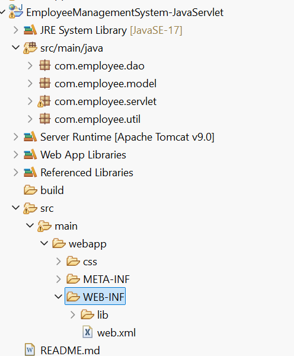
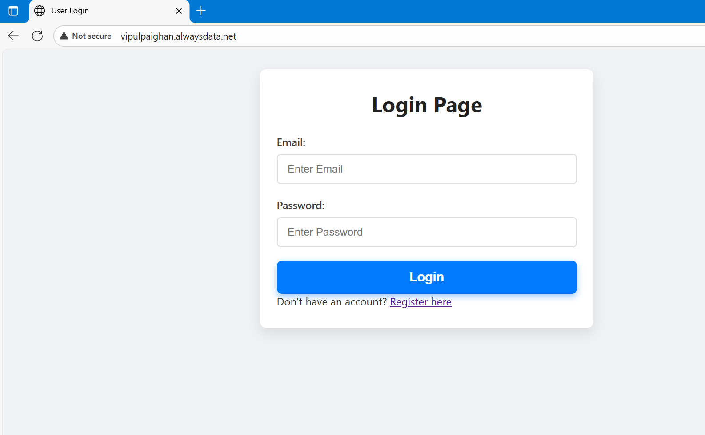
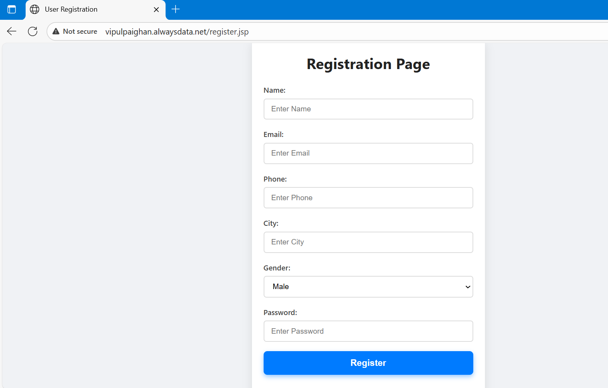
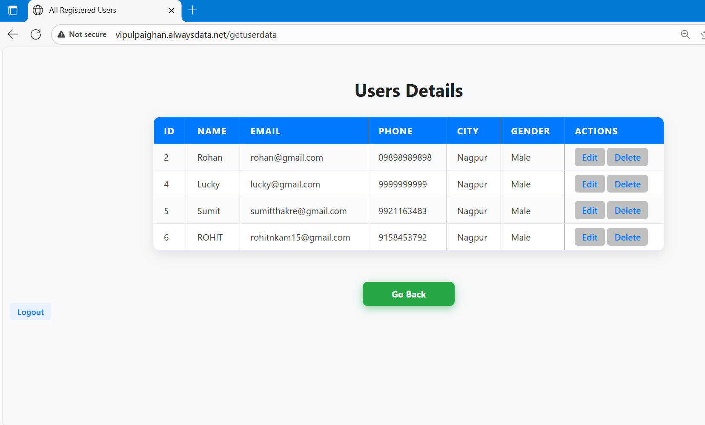
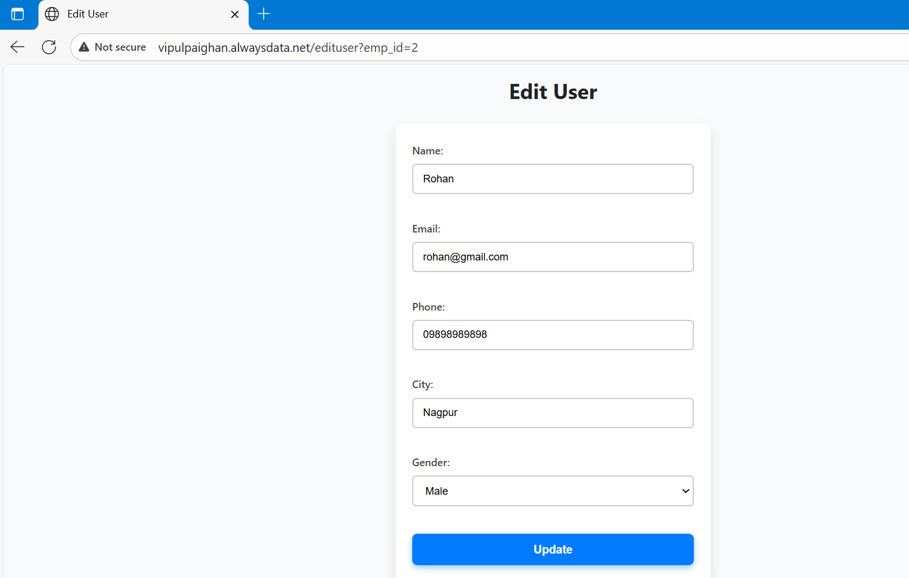

# Employee Management System – Java Servlet, JSP & MySQL

## Overview
The **Employee Management System** is a web-based application built using **Java Servlets, JSP, and MySQL** that allows businesses to manage employee information efficiently.  
This project provides a simple interface to register, log in, and perform **CRUD** (Create, Read, Update, Delete) operations on employee data.

**Live Demo:** [Click Here](http://vipulpaighan.alwaysdata.net/)

---

##  Features
- **Employee Registration & Login**
- **Secure Authentication** with Session Management
- **View All Employees**
- **Edit Employee Details**
- **Delete Employees**
- **Data Storage** in MySQL Database
- Deployable on **Apache Tomcat Server**

---

## Technologies Used
- **Backend:** Java Servlets  
- **Frontend:** JSP, HTML, CSS  
- **Database:** MySQL  
- **Server:** Apache Tomcat  
- **IDE:** Eclipse  

---

## Project Structure

---

## Installation & Setup

### 1️⃣ Clone the Repository

- git clone https://github.com/vipultechstack/employee-management-system-java-servlet.git

- cd Employee-Management-System-Java-Servlet

### 2️⃣ Configure MySQL Database
- Create a new database:

- CREATE DATABASE database_name;

- Import the provided SQL file (employee.sql) to set up tables.

#### Update your database credentials in the DAO class:

- String jdbcURL = "jdbc:mysql://localhost:3306/vipulpaighan_employee_db";
- String jdbcUsername = "UserName";
- String jdbcPassword = "Password";

### 3️⃣ Deploy on Tomcat
-Open the project in Eclipse.

- Add Apache Tomcat Server to Eclipse.

- Run the project on Tomcat.

### 4️⃣ Access the Application
- Visit: http://localhost:8080/Employee-Management-System

### Screenshots

## License
This project is licensed under the MIT License – you are free to use and modify it.

## Author
Vipul Paighan – Software Developer & Data Analyst

## Contact
For custom work or paid installs: vipulpaighan.1988@gmail.com
